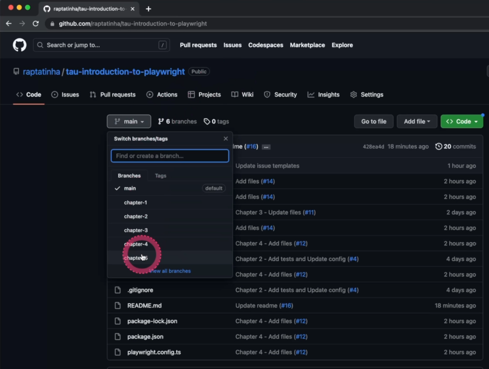

# Introdução ao Playwright

Olá a todos.

Bem-vindos ao treinamento de Introdução ao Playwright na Test Automation University.

Meu nome é Renata e sou honrada de ser seu instrutor.

Sou do Brasil, e agora moro em São Francisco, California.

O Playwright impressionou-me pela sua simplicidade e eficiência, e por isso estou aqui hoje com vocês.

O Playwright é um framework que permite testes de ponta a ponta confiáveis para aplicativos web modernos.

Ele suporta várias linguagens, e neste curso, iremos focalizar no Typescript.

Conforme vocês podem ver, temos muito a cobrir.

Após cinco capítulos, vocês poderão construir uma base sólida para implementar testes usando o Playwright em qualquer projeto.

No primeiro capítulo, vocês aprenderão como usar a documentação do Playwright, como instalar e executar os testes, e como usar a IDE VS Code e sua extensão do Playwright.

No segundo capítulo, vocês aprenderão como configurar o runner de testes, como executar os comandos para executar o teste com essa configuração, e como escrever o seu primeiro teste.

No terceiro capítulo, vocês aprenderão sobre os diferentes métodos a serem usados em uma estrutura de teste e também como usar "page objects" com esses testes.

No quarto capítulo, vocês aprenderão como usar ferramentas de regressão visual com o Applitools e o Playwright, e terão testes mais robustos.

Por fim, no quinto capítulo, vocês aprenderão como solucionar os problemas usando os relatórios, o modo UI e o modo de debug.

[Neste Repositorio](https://github.com/raptatinha/tau-introduction-to-playwright), vocês podem encontrar todas as branches por capítulo, e terão o código atualizado para eles.

Vocês tem a pasta "exercises" com todos os exercícios, bem como os recursos extras.

Se você rolar um pouco para baixo, você encontrará instruções para configurar esse projeto - para bifurcar e clonar, e para instalar o projeto.

Se você precisar de ajuda ou tiver alguma pergunta, não hesite em postar em nossa guia "Issues".

  

Você pode clicar em "New Issue" e selecionar uma das opções disponíveis.

Antes de começarmos nossa jornada juntos, uma última coisa - eu encorajo você ver os links abaixo.

E, por fim, se você precisar de alguma ajuda extra ou simplesmente quiser conversar, fique à vontade para entrar em contato.

Happy testing.

## Resources
- [Playwright website](https://playwright.dev/)
- [Introduction to Playwright - GitHub repository](https://github.com/raptatinha/tau-introduction-to-playwright)
- [Renata Andrade - Instructor website](https://testingwithrenata.com/)